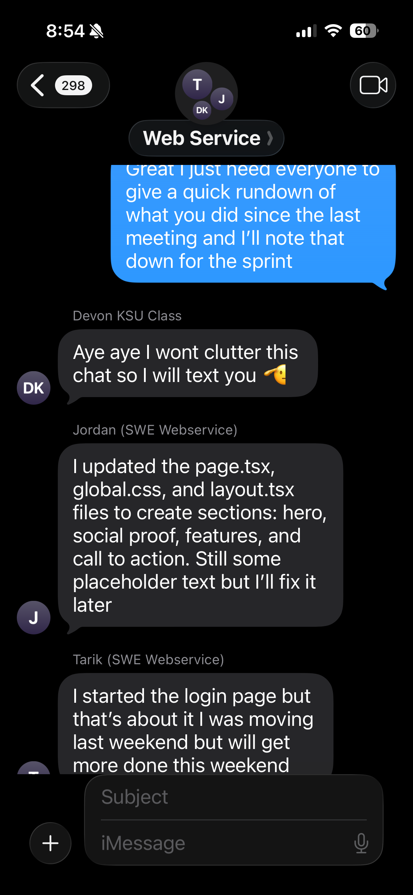

# Sprint 1 Outline

## Daily Scrum Meeting

- **Time**: 6:00 PM - 6:15 PM
- **Location**: Group Chat
- **Agenda**:
  - Each team member shares:
    - What they accomplished since the last meeting

- Jordan: 
    - "I updated the page.tsx, global.css,and layout.tsx files to create sections: hero, social proof, features, and call to action. Still some placeholder text but I'll fix it later."
- Tarik:
    - "I started the login page but that's about it. I was moving last weekend but will get more done this week."
- Devon: 
    - "I have been sketching out how i want the create a user page to look like while touching up on connecting athentication since they go hand in hand."
- Austin:
    - "I have created the repository and set up the project structure by creating the NEXT.JS project while also connecting the project to our database. I have also planned out the structure for Sprint 1."

