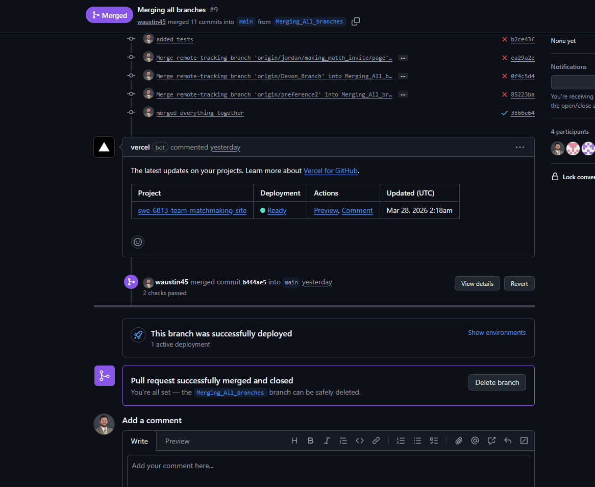

# Continuous Deployment

How Continuous deployment system is being conducted with Github and Vercel.
Each time we push a new branch or to main, our repo is built and deployed to a Vercel instance which is publicly hosted.

As you can see, when a branch is merged into main, Vercel builds and deploys our repository.

URL: https://swe-6813-team-matchmaking-site.vercel.app/ 